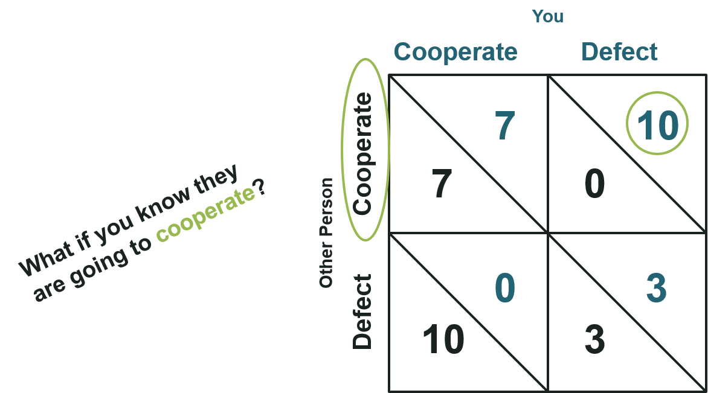
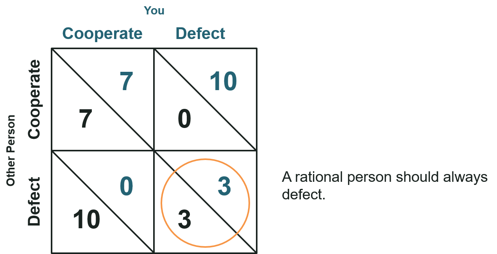

```{r, setup, echo=FALSE, results='hide', warning=FALSE, message=FALSE, error=TRUE}

  # Checks to see if a package is already installed.
  is_installed <- function(package_name) is.element(package_name, installed.packages()[,1])
  
  # If a package is not installed, install it. Then load the package.
  install_and_load <- function(package_name) {
    if(!is_installed(package_name)) {
      install.packages(package_name)
    }
    library(package_name, character.only = TRUE)
  }
  
  library(png) 
  install_and_load("ggtern")
  
```

```{r, initialize some variables, echo=FALSE, results='hide', warning=FALSE, message=FALSE, error=TRUE}
  # frequency_c <- seq(0.0, 1.0, 0.01)
  freq_d <- seq(0.0, 1.0, 0.01)

  # Define the payoffs for a play such that the first letter is the opponent's
  # move and the second is the focal player
  # i.e. p_dc is the payoff when the focal player cooperates and the 
  # oppenent defects.
  p_cc <- 7
  p_cd <- 10
  p_dc <- 0
  p_dd <- 3
  
  d_color <- 'red3'
  c_color <- 'chartreuse4'
  tft_color <- 'steelblue4'
  
  mu <- seq(1, 15, 2)   # expected number of interactions
```


```{r, A researcher\'s dilemma, fig.width=8.0, echo=FALSE, fig.align='center'}

   
  library(grid)
  img <- readPNG("assets/img/whats_in_it_for_me.png")
  grid.raster(img, just="centre")

```

---&vcenter

<h1 class='jumbo'>We Need Solutions That Survive the <span class='warning'>WWJD</span> Test<h1>

---


```{r, Ayn Rand saying What would John Galt do, out.width="800px", echo=FALSE, fig.align='center'}
  knitr::include_graphics('assets/img/ayn_rand.png')
```

---&twocol

## A Game Theoretic Approach

*** {name: left}
<br/>
 - Developed in the 1928 by John von Neumann
 - Used to determine optimal behavior
 <br/>
 - Basic Approach
   - Determine Payoffs
   - Detrmine Strategies
   - Find equilibria

*** {name: right}
<br/>
<br/>
```{r, Introduce Game Theory, out.width="300px", echo=FALSE, fig.align='center'}
  knitr::include_graphics('assets/img/john_von_neuman.png')
```

*** {name: footer}
<blockquote>Truth...is much too complicated to allow anything but approximations. <br/><span class="author">-John Von Neumann</span></blockquote>

---
## Prisoners' Dilemma
<br/>
<br/>

```{r, Introduce the Prisoners Dilemma, out.width="700px", echo=FALSE, fig.align='center'}
  knitr::include_graphics('assets/img/prisoners_dilemma_first.png')
```

<br/>
<hr/>

*** {name: footer}
<blockquote>Beware of altruism. It is based on self-deception, the root of all evil. <br/><span class="author">-Robert Heinlein in "Time Enough for Love"</span></blockquote>

---

```{r, Determining the Payoffs, out.width="600px", echo=FALSE, fig.align='center'}
  knitr::include_graphics('assets/img/cost_benefits.png')
```

<hr/>
<br/>
<h4 class="text-centered">
  <span class="info">Payoff</span> = 
  <span class="success">Benefits</span> - 
  <span class="warning">Cost</span> => Chance of Promotion
</h4>

<br/>
<hr/>

*** {name: footer}
<blockquote>Nature is an expert in cost-benefit analysis. Although she does her accounting a little differently, she always collects in the long run. <br/><span class="author">-Margaret Atwood</span></blockquote>

---

## Play a Game With Your Neighbor

<br/>
<br/>

```{r, Audience Plays 1, out.width="600px", echo=FALSE, fig.align='center'}
  knitr::include_graphics('assets/img/audience_play1.png')
```

<br/>
<br/>
<hr/>

*** {name: footer}
<blockquote>Every time you play your hand the way you would if you could see your opponent's cards, you gain, and every time your oppenents play their cards differently from the way they would play them if they could see your cards, you gain.<span class="author">-David Sklansky (3x World Series of Poker Champion, poker theoretician and author)</span></blockquote>

---

## Play a Game With Your Neighbor

<br/>
<br/>

```{r, Audience Plays 2, out.width="600px", echo=FALSE, fig.align='center'}
  
```

<br/>
<br/>
<hr/>

*** {name: footer}
<blockquote>The only redeeming thing about mankind is coopration.<span class="author">-Bertrand Russell (Philosopher, Author, Nobel Laureate)</span></blockquote>

---

## Play a Game With Your Neighbor

<br/>
<br/>

```{r, Audience Plays 3, out.width="600px", echo=FALSE, fig.align='center'}
  knitr::include_graphics('assets/img/audience_play3.png')
```

<br/>
<br/>
<hr/>

*** {name: footer}
<blockquote>A single raised eyebrow. "You've defected, sweetheart. No use worrying about the big, bad wolf now.<span class="author">-Nalini Singh in "Kiss of Snow"</span></blockquote>

---

## Two Player Single Play Equilibrium

<br/>
<br/>

```{r, Two Player Single Play Equilibrium, out.width="600px", echo=FALSE, fig.align='center'}
  
```

<br/>
<br/>
<hr/>

*** {name: footer}
<blockquote>Neither pleasure nor pain should enter as motives when one must do what must be done.<span class="author">-Julius Evola in "Ride the Tiger: A Survival Manual for the Aristocrats of the Soul"</span></blockquote>

---&vcenter

<h3 class='jumbo'>Expanding to the Population Level</h3>
<h1 class= 'jumbo info'>The Person Over There Seems More Trustworthy</h1>

---

## Playing Against a Population

```{r, Simple PD with population, echo=FALSE, fig.align='center', out.width="500px", out.height="500px"}
  fit_c <- freq_d * p_dc + (1 - freq_d) * p_cc
  fit_d <- freq_d * p_dd + (1 - freq_d) * p_cd
  plot(freq_d, fit_d, type = 'l', col = d_color, ylim=c(0, 10), xlim=c(0.0, 1.0), xaxs='i', yaxs='i', xlab = 'Frequency of Defectors', ylab = 'Expected Payoff')
  lines(freq_d, fit_c, col = c_color)
  legend( 0.05, 9.5, c('Defectors', 'Cooperators'), col=c(d_color, c_color), lty=1)

```
<hr/>

*** {name: footer}
<blockquote>Expectation is the mother of all frustration. <br/><span class="author">-Antonio Banderas</span></blockquote>

--- .big-picture
<div class='image ape-pic'>
```{r, I want to play again, out.width="1200px", echo=FALSE}
  
```
  <div class="text">
    <h2> I Want To Play Again! </h2>
  </div>
</div>

---

## Playing More Than Once

```{r, C vs D repeated interactions, , echo=FALSE, fig.align='center'}
fit_c_in_c_vs_d_iterated <- ((freq_d * p_dc) * mu[[3]])/mu[[3]] + (((1 - freq_d) * p_cc) * mu[[3]])/mu[[3]]
fit_d_in_c_vs_d_iterated <- ((freq_d * p_dd) * mu[[3]])/mu[[3]] + (((1 - freq_d) * p_cd) * mu[[3]])/mu[[3]]
plot(freq_d, fit_d_in_c_vs_d_iterated, type = 'l', col = d_color, ylim=c(0, 10), xlim=c(0.0, 1.0), xaxs='i', yaxs='i', xlab = 'Frequency of Defectors', ylab = 'Expected Payoff')
lines(freq_d, fit_c_in_c_vs_d_iterated, col = c_color)
legend( 0.05, 9.5, c('Defectors', 'Cooperators'), col=c(d_color, c_color), lty=1)


```

---&twocol

## Tit For Tat

<br>
<br>

*** {name: left}
```{r, Tit For Tat flow, out.width="500px", echo=FALSE, fig.align='center'}
  knitr::include_graphics('assets/img/tft_flow.png')
```

*** {name: right}
```{r, Tit for Tat Attributes, out.width="500px", echo=FALSE, fig.align='center'}
  
```


*** {name: footer}
<br>
<br>

<hr/>
<blockquote>There is one word which may serve as a rule of practice for all one&apos;s life - reciprocity.<br/><span class="author">-Confucius</span></blockquote>

---

## Tit For Tat In A Population

```{r, TFT vs D repeated interactions, , echo=FALSE, fig.align='center'}

  fit_tft_in_tft_vs_d_3 <- freq_d * ((p_dc / mu[[2]]) + ((p_dd * (mu[[2]] - 1)))/mu[[2]]) + (1 - freq_d) * p_cc
  fit_tft_in_tft_vs_d_9 <- freq_d * ((p_dc / mu[[5]]) + ((p_dd * (mu[[5]] - 1)))/mu[[5]]) + (1 - freq_d) * p_cc
  fit_tft_in_tft_vs_d_15 <- freq_d * ((p_dc / mu[[8]]) + ((p_dd * (mu[[8]] - 1)))/mu[[8]]) + (1 - freq_d) * p_cc
  
  fit_d_in_tft_vs_d_3 <- freq_d * p_dd + (1 - freq_d) * (p_cd/mu[[2]] + (p_dd * (mu[[2]] - 1))/mu[[2]])
  fit_d_in_tft_vs_d_9 <- freq_d * p_dd + (1 - freq_d) * (p_cd/mu[[5]] + (p_dd * (mu[[5]] - 1))/mu[[5]])
  fit_d_in_tft_vs_d_15 <- freq_d * p_dd + (1 - freq_d) * (p_cd/mu[[8]] + (p_dd * (mu[[8]] - 1))/mu[[8]])
  
  plot(freq_d, fit_d_in_tft_vs_d_3, type = 'l', col = d_color, ylim = c(0, 8), xlim = c(0.0, 1.0), xaxs = 'i', yaxs = 'i', xlab = 'Frequency of Defectors', ylab = 'Expected Payoff', lty = 3)
  lines(freq_d, fit_d_in_tft_vs_d_9, col = d_color, lty = 2)
  lines(freq_d, fit_d_in_tft_vs_d_15, col = d_color, lty = 1)
  lines(freq_d, fit_tft_in_tft_vs_d_3, col = tft_color, lty = 3)
  lines(freq_d, fit_tft_in_tft_vs_d_9, col = tft_color, lty = 2)
  lines(freq_d, fit_tft_in_tft_vs_d_15, col = tft_color, lty = 1)
  
  legend(0.65, 9.5, c('Defectors', 'Cooperators'), col = c(d_color, tft_color), lty=1)
  legend(0.65, 7.5, c('3 Interactions', '9 Interactions', '15 Interactions'), lty=c(3, 2, 1))


```

---

```{r, Ternary Plot with 3 interactions, , echo=FALSE, fig.align='center'}
  freq_c = c()
  freq_d = c()
  freq_tft = c()
  for(i in seq(0.0, 1.0, 0.01)) {
    for(j in seq(0.0, (1.0 - i), 0.01)) {
      freq_c <- c(freq_c, i)
      freq_d <- c(freq_d, j)
      freq_tft <- c(freq_tft, 1 - i - j)
    }
  }
  tern_data <- cbind.data.frame(freq_c, freq_d, freq_tft)

  tern_data$fit_c_3 <- tern_data$freq_c * p_cc + 
                       tern_data$freq_tft * p_cc + 
                       tern_data$freq_d * p_dc
  tern_data$fit_tft_3 <- tern_data$freq_c * p_cc + 
                         tern_data$freq_tft * p_cc + 
                         tern_data$freq_d * (p_dc/mu[[2]] + (p_dd * (mu[[2]] -1))/mu[[2]])

  tern_data$fit_d_3 <- tern_data$freq_c * p_cd + 
                       tern_data$freq_tft * (p_cd/mu[[2]] + (p_dd * (mu[[2]] - 1))/mu[[2]]) + 
                       tern_data$freq_d * p_dd
  
  tern_data$opt_3 <- ifelse(tern_data$fit_c_3 >= tern_data$fit_d_3 & 
                            tern_data$fit_c_3 >= tern_data$fit_tft_3, 'Cooperate',
                       ifelse(tern_data$fit_d_3 >= tern_data$fit_c_3 & 
                              tern_data$fit_d_3 >= tern_data$fit_tft_3, 'Defect', 'TFT'))
  
  base = ggtern(data=tern_data, aes(freq_c, freq_d, freq_tft, color = factor(opt_3), alpha = 0.5))
base + theme_matrix() + geom_point(alpha = 0.1) +  scale_color_manual(values = c(c_color, d_color, tft_color)) + theme_showarrows() + labs(title = "Optimal Strategy\nInteractions = 3", fill = "Strategy", x = 'Cooperate', y = 'Defect', z = 'TFT')


```


