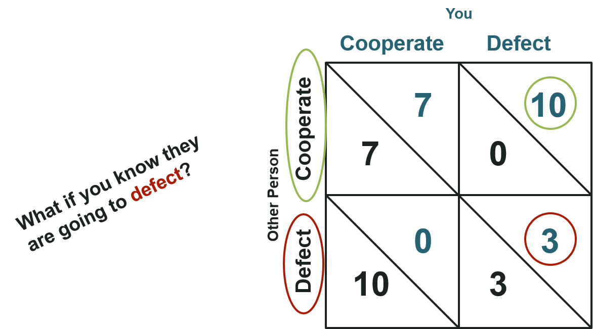
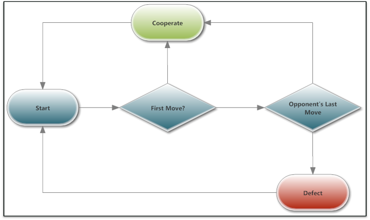

*** {name: pnotes}
a test

---&vcenter

<h1 class='jumbo'>We Need Solutions That Survive the WWJD Test<h1>

---

---&twocol

## A Game Theoretic Approach

*** {name: left}
 
 - Developed in 1928 by John von Neumann
 - Used to determine 
   - Optimal Behavior
   - Expected Behavior
  
 - Basic Approach
   - Determine Payoffs
   - Determine Strategies
   - Find Equilibria

*** {name: right}
 
 

*** {name: footer}

 

<blockquote>Truth...is much too complicated to allow anything but approximations.  -John Von Neumann</blockquote>

---
## Prisoners' Dilemma
 
 

 

*** {name: footer}
<blockquote>Beware of altruism. It is based on self-deception, the root of all evil.  -Robert Heinlein in "Time Enough for Love"</blockquote>

---

 
<h4 class="text-centered">
  Payoff = 
  Benefits - 
  Cost => Chance of Promotion
</h4>

 

*** {name: footer}
<blockquote>Nature is an expert in cost-benefit analysis. Although she does her accounting a little differently, she always collects in the long run.  -Margaret Atwood</blockquote>

---

## Play a Game With Your Neighbor

 
 

 
 

*** {name: footer}
<blockquote>Every time you play your hand the way you would if you could see your opponent's cards, you gain, and every time your oppenents play their cards differently from the way they would play them if they could see your cards, you gain.-David Sklansky (3x World Series of Poker Champion, poker theoretician and author)</blockquote>

---

## Play a Game With Your Neighbor

 
 

 
 

*** {name: footer}
<blockquote>The only redeeming thing about mankind is coopration.-Bertrand Russell (Philosopher, Author, Nobel Laureate)</blockquote>

---

## Play a Game With Your Neighbor

 
 

 
 

*** {name: footer}
<blockquote>A single raised eyebrow. "You've defected, sweetheart. No use worrying about the big, bad wolf now.-Nalini Singh in "Kiss of Snow"</blockquote>

---

## Two Player Single Play Equilibrium

 
 

 
 

*** {name: footer}
<blockquote>Neither pleasure nor pain should enter as motives when one must do what must be done.-Julius Evola in "Ride the Tiger: A Survival Manual for the Aristocrats of the Soul"</blockquote>

---&vcenter

<h3 class='jumbo'>Expanding to the Population Level</h3>
<h1 class= 'jumbo info'>The Person Over There Seems More Trustworthy</h1>

---

## Playing Against a Population

*** {name: footer}

<blockquote>Expectation is the mother of all frustration.  -Antonio Banderas</blockquote>

--- .big-picture

  

    <h2> I Want To Play Again! </h2>
  

---

## Playing More Than Once

*** {name: footer}

<blockquote>Game over man!! GAME OVER!  -Bill Paxton in "Aliens"</blockquote>

---&twocol

## Tit For Tat

 
 

*** {name: left}

*** {name: right}

*** {name: footer}
 
 

<blockquote>There is one word which may serve as a rule of practice for all one&apos;s life - reciprocity. -Confucius</blockquote>

---

## Tit For Tat In A Population

*** {name: footer}

<blockquote>It&apos;s good to have the opportunity to help others who have helped you. It&apos;s not about &ldquo;tit for tat&rdquo; it&apos;s  about &ldquo;I love you, too.&rdquo; -Karen E. Quinones Miller (Author, Community Activist)</blockquote>

---

## Optimal Strategies in a Free For All

*** {name: footer}

<blockquote>The devil can cite Scripture for his purpose. -William Shakespear in &ldquo;The Merchant of Venice&rdquo;</blockquote>

---

---

## Open Science Works If...
 
 

---

## Questions?

 
 

<h5> Code is available at <a href="https://github.com/olendorf/open_science_game">https://github.com/olendorf/open_science_game</a>

 
 

<h5> Slides can be views at <a href="https://olendorf.github.io/open_science_game">https://olendorf.github.io/open_science_game</a>
